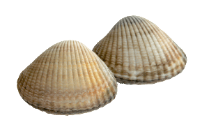
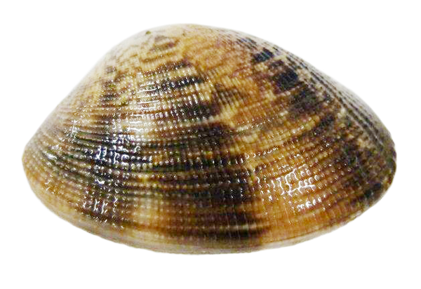
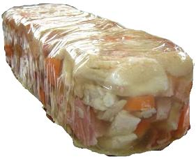
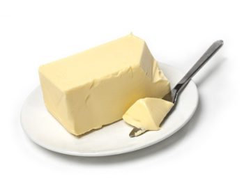
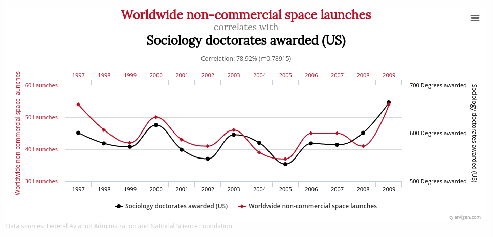

```{r setup, echo=FALSE}
library(knitr)
knitr::opts_chunk$set(echo = FALSE)

library(questionr)
data(hdv2003)

gen_example_table <- function(values) {
  tab <- matrix(values, nrow = 2, byrow = TRUE)
  rownames(tab) <- c("Cérastoculture", "Vénériculture")
  colnames(tab) <- c("Potjevleesch", "Kouign-amann")
  kable(tab, format = "html")
}

gen_example_table_md <- function(values) {
  tab <- matrix(values, nrow = 2, byrow = TRUE)
  rownames(tab) <- c("Cérastoculture", "Vénériculture")
  colnames(tab) <- c("Potjevleesch", "Kouign-amann")
  kable(tab, format = "markdown")
}

```


---
class: center, middle, inverse

# Rappel


---

### Rappel 

Question en sociologie de la réception : lien entre l’âge et le livre préféré.

--

|                                   | 0-10 ans| 11-40 ans| 41-90 ans | > 91 ans|
|-----------------------------------|--------:|---------:|----------:|--------:|
|*Trotro fait du vélo*              |       74|        35|         72|        3|
|*Tractatus<br>logico-philosophicus*|        2|       157|        312|        1|

--

.center[Quelle méthode pour décrire le lien entre ces deux variables ?]

---

### Rappel

☐ On regarde le tri croisé en effectifs

☐ On calcule des pourcentages ligne ou colonne

☐ On fait un test du χ²

---

### Rappel


☑ On regarde le tri croisé en effectifs

☑ On calcule des pourcentages ligne ou colonne

☐ ~~On fait un test du χ²~~

---

### Rappel

#### Tri croisé en effectifs

|                                   | 0-10 ans| 11-40 ans| 41-90 ans | > 91 ans|
|-----------------------------------|--------:|---------:|----------:|--------:|
|*Trotro fait du vélo*              |       74|        35|         72|        3|
|*Tractatus<br>logico-philosophicus*|        2|       157|        312|        1|


---

### Rappel

#### Pourcentages colonne

|                                   |  0-10 ans| 11-40 ans| 41-90 ans| > 91 ans|
|-----------------------------------|---------:|---------:|---------:|--------:|
|*Trotro fait du vélo*              |     97.4 %|     18.2 %|     18.8 %|      75 %|
|*Tractatus<br>logico-philosophicus*|      2.6 %|     81.8 %|     81.2 %|      25 %|
|**Total**                          |  **100 %**|  **100 %**|  **100 %**| **100 %**|


**Lecture :** 97.4 % des 0 à 10 ans préfèrent *Trotro fait du vélo*, contre seulement 18.2 % des 11-40 ans.


---

### Rappel

Lien entre deux variables dans un tableau croisé ➟ pourcentages ligne ou colonne.

--

Le χ² ne sert pas à décrire ou évaluer le lien.


Mais alors ça sert à quoi ?

---
class: center, middle, inverse

# Mise en situation


---

### Bonne nouvelle

Vous avez remporté un appel à projet !

--

Grande enquête en partenariat avec les hypermarchés E. Leclerc Sud-Bretagne.


.center[]

---

### Bonne nouvelle

#### Sujet de l’enquête

Les goûts alimentaires des conchyliculteurs

Plus précisément, savoir s’il y a un lien entre le type de conchyliculture exercée et le plat préféré.

--
 
#### Protocole

- Enquête par questionnaire
- Interrogation de 100 conchyliculteurs à la sortie de plusieurs hypermarchés E. Leclerc de Sud-Bretagne
 
---

### Modalités

#### Conchyliculture

.pull-left.compact[
.center[]

.center[Cérastoculture]
]

--

.pull-right.compact[
.center[]

.center[Vénériculture]
]

.clear[
]

--

#### Plat préféré

.pull-left.compact[

.center[]

.center[Potjevleesch]
]

--

.pull-right.compact[

.center[]

.center[Kouign-amann]
]


---

### Résultats à Quimperlé

--

```{r}
gen_example_table(c(50, 0, 0, 50))
```

--
 
.center[**Lien ou pas lien ?**]

---


### Résultats à Ploërmel

--

```{r}
gen_example_table(c(25, 25, 25, 25))
```

--

.center[**Lien ou pas lien ?**]

---

### Résultats à Riantec

--

```{r}
gen_example_table(c(32, 18, 18, 32))
```

.center[**Lien ou pas lien ?**]

---

### Résultats à Quéven

--

```{r}
gen_example_table(c(27, 23, 23, 27))
```

.center[**Lien ou pas lien ?**]

---

### Damned

Nous voilà bien démunis.

--

Heureusement, le test du χ² arrive à notre secours…

--

Mais pourquoi en a-t-on besoin ?

---

### Pourquoi en a-t-on besoin ?

```{r}
gen_example_table(c(26, 24, 24, 26))
```

--

.center[À cause du *biais d’échantillonnage* !]

--

.center[https://frama.link/khi2]

---

### Le biais d’échantillonnage

Le biais d’échantillonnage est lié au fait qu’on n’a interrogé qu’un échantillon de notre population, et pas la population entière.

La théorie des probabilités nous dit qu’un échantillon de taille suffisante finit par "ressembler" à notre population. Mais une "marge de fluctuation" demeure : c’est le biais d’échantillonnage.

Plus le nombre de personnes interrogées est élevé, plus le biais d’échantillonnage est faible.

---

### Le biais d’échantillonnage

L’objectif du test du χ² est de déterminer si les variations observées dans un tableau croisé (les écarts à l’indépendance) pourraient être dues uniquement au biais d’échantillonnage.

#### Conséquence importante et parfois méconnue

Il est inutile de faire un test du χ² si vos données contiennent la totalité de votre population !

--

.footnote[
Julien Gros, "Quantifier en ethnographe", *Genèses* n°108, 2017, https://www.cairn.info/revue-geneses-2017-3-page-129.htm
]

---
class: center, middle, inverse

# L’hypothèse d’indépendance


---

### L’hypothèse d’indépendance

#### Qu’est-ce que l’indépendance ?

L’indépendance, c’est quand il n’y a pas de lien entre les deux variables croisées.

--

L’indépendance, c’est quand le fait d’appartenir à une modalité en colonne n’a pas d’influence sur le fait d’appartenir à une modalité en ligne (et réciproquement).

--

#### Exemple

```{r}
gen_example_table(c(25, 25, 25, 25))
```

---

### L’hypothèse d’indépendance

**C’est pas si simple !** 

--

|               | Potjevleesch| Kouign-amann|
|:--------------|-------------:|------------:|
|Cérastoculture |            25|           25|
|Vénériculture  |            25|           25|


---

### L’hypothèse d’indépendance

**C’est pas si simple !** 


|               | Potjevleesch| Kouign-amann| **Ensemble**|
|:--------------|-------------:|------------:|------------:|
|Cérastoculture |            25|           25|       **50**|
|Vénériculture  |            25|           25|       **50**|


---

### L’hypothèse d’indépendance

**C’est pas si simple !** 


|               | Potjevleesch| Kouign-amann| **Ensemble**|
|:--------------|-------------:|------------:|------------:|
|Cérastoculture |            25|           25|       **50**|
|Vénériculture  |            25|           25|       **50**|
|**Ensemble**   |        **50**|       **50**|      **100**|

--

.center[On doit respecter la *contrainte sur les marges*]

---

### L’hypothèse d’indépendance

La contrainte sur les marges signifie qu'on doit retrouver dans les marges du tableau croisé les *tris à plat* des deux variables.

--

|               | Potjevleesch| Kouign-amann| **Ensemble**|
|:--------------|-------------:|------------:|------------:|
|Cérastoculture |              |             |       **60**|
|Vénériculture  |              |             |       **40**|
|**Ensemble**   |        **10**|       **90**|      **100**|


---

### L’hypothèse d’indépendance

#### Rappel 

Il y a indépendance si l’appartenance à une modalité
en ligne de notre tableau n’a pas d’influence sur la modalité en
colonnes.

#### Conséquence

Il y a indépendance si les pourcentages ligne sont les mêmes pour toutes les lignes.

---

### L’hypothèse d’indépendance


#### Pourcentages ligne

.compact[
|               | Potjevleesch| Kouign-amann|
|:--------------|-------------:|------------:|
|Cérastoculture |              |             |
|Vénériculture  |              |             |
|**Ensemble**   |      **10 %**|     **90 %**|
]

---

### L’hypothèse d’indépendance

#### Pourcentages ligne

.compact[
|               | Potjevleesch| Kouign-amann|
|:--------------|-------------:|------------:|
|Cérastoculture |        10 %  |       90 %  |
|Vénériculture  |        10 %  |       90 %  |
|**Ensemble**   |      **10 %**|     **90 %**|
]

---

### L’hypothèse d’indépendance

#### Pourcentages ligne

.compact[
|               | Potjevleesch| Kouign-amann|
|:--------------|-------------:|------------:|
|Cérastoculture |        10 %  |       90 %  |
|Vénériculture  |        10 %  |       90 %  |
|**Ensemble**   |      **10 %**|     **90 %**|
]

#### Pourcentages colonne

.compact[
|               | Potjevleesch| Kouign-amann| **Ensemble**|
|:--------------|-------------:|------------:|------------:|
|Cérastoculture |              |             |     **60 %**|
|Vénériculture  |              |             |     **40 %**|
]

---

### L’hypothèse d’indépendance

#### Pourcentages ligne

.compact[
|               | Potjevleesch| Kouign-amann|
|:--------------|-------------:|------------:|
|Cérastoculture |        10 %  |       90 %  |
|Vénériculture  |        10 %  |       90 %  |
|**Ensemble**   |      **10 %**|     **90 %**|
]

#### Pourcentages colonne

.compact[
|               | Potjevleesch| Kouign-amann| **Ensemble**|
|:--------------|-------------:|------------:|------------:|
|Cérastoculture |         60 % |        60 % |     **60 %**|
|Vénériculture  |         40 % |        40 % |     **40 %**|
]

---
class: center, middle


---

### L’hypothèse d’indépendance

On va pouvoir calculer le tableau des **pourcentages théoriques** sous
l’hypothèse d’indépendance :

|               | Potjevleesch| Kouign-amann| **Ensemble**|
|:--------------|-------------:|------------:|------------:|
|Cérastoculture |          ? % |             |     **60 %**|
|Vénériculture  |              |             |     **40 %**|
|**Ensemble**   |      **10 %**|     **90 %**|    **100 %**|


--

$$?\% = 60\% \times 10\% = 6\%$$

---

### L’hypothèse d’indépendance

#### Pourcentages théoriques

.compact[
|               | Potjevleesch| Kouign-amann| **Ensemble**|
|:--------------|-------------:|------------:|------------:|
|Cérastoculture |           6 % |        54 %  |      **60 %**|
|Vénériculture  |           4 % |        36 %  |      **40 %**|
|**Ensemble**   |       **10 %**|      **90 %**|     **100 %**|
]

--

#### Effectifs théoriques

On multiplie par le nombre de personnes interrogées :

.compact[
|               | Potjevleesch| Kouign-amann| **Ensemble**|
|:--------------|-------------:|------------:|------------:|
|Cérastoculture |          14.4|        129.6|      **144**|
|Vénériculture  |           9.6|        86.4 |       **96**|
|**Ensemble**   |        **24**|      **216**|     **240** |
]

---
class: center, middle


---

### Récapitulatif

#### Définition de l’indépendance entre lignes et colonnes d’un tableau croisé

Le fait d’appartenir à une ligne n’a pas d’influence sur la colonne d’appartenance (et réciproquement).

⇔ Les pourcentages ligne du tableau croisé sont tous identiques.
 
⇔ Les pourcentages colonne du tableau croisé sont tous identiques.

--

#### Calcul du tableau croisé sous l’hypothèse d’indépendance

- Contrainte sur les marges.
- Calcul des pourcentages théoriques à partir des marges, puis calcul  des effectifs théoriques.
- *C’est le logiciel qui s’en occupe*


---
class: center, middle, inverse

# Mesurer l’écart à l’indépendance


---

### L’écart à l’indépendance

Du tableau croisé suivant, qui croise sexe et sentiment d’appartenir à
une classe sociale :

.compact[
```{r}
tab <- matrix(c(446, 445, 8,
                490, 592, 19),
              nrow = 2, byrow = TRUE)
colnames(tab) <- c("Oui", "Non", "NSP")
rownames(tab) <- c("Homme", "Femme")
tab <- as.table(tab)
kable(tab, format="html")
```
]

--

On sait calculer le tableau croisé théorique sous
l’hypothèse d’indépendance :

.compact[
```{r}
tab_exp <- round(chisq.test(tab)$expected, 1)
kable(tab_exp, format="html")
```
]

--

.clear[
&nbsp;
]

.center[**Comment calculer un "écart" entre les deux ?**]

---
class: center, middle


---

### L’écart à l’indépendance

.pull-left.compact[
```{r}
kable(tab, format="html")
```
]

<div style="position: absolute; top: 23%; left: 48.5%; font-size: 80px;">

</div>

.pull-right.compact[
```{r}
kable(tab_exp, format="html")
```
]

---

### L’écart à l’indépendance

.pull-left.compact[
```{r}
kable(tab, format="html")
```
]

<div style="position: absolute; top: 20%; left: 48.5%; font-size: 80px;">
-
</div>

.pull-right.compact[
```{r}
kable(tab_exp, format="html")
```
]

--

.clear[
]

<div style="font-size: 70px; margin-bottom: -3rem;">
.center[=]
</div>

```{r}
kable(tab - tab_exp, format="html")
```


---


### L’écart à l’indépendance

On a notre tableau d’écarts :

.compact[
```{r}
kable(tab - tab_exp, format="html")
```
]

On n’a plus qu’à faire la somme !

--

**Problème :** la somme fait toujours 0.

--

**Solution :** On élève les écarts au carré.

$$(\text{Effectif observé} - \text{Effectif théorique})^2$$

---

### L’écart à l’indépendance


.pull-left.compact[

.center[Effectifs théoriques]

```{r}
kable(tab_exp, format="html")
```
]


.pull-right.compact[

.center[Écarts]

```{r}
kable(round((tab - tab_exp), 1), format="html")
```
]

.clear[
&nbsp;
]
--

**Problème :** on additionne des choux et des carottes !

--

**Solution :** on divise par les effectifs théoriques.
$$\frac{ ( \text{Effectif observé} - \text{Effectif théorique})^2}{\text{Effectif théorique}} = \text{$\chi^2$ partiel}$$


---

### Statistique du χ² 

On calcule les χ² partiels pour notre tableau :


```{r}
kable(round((tab - tab_exp)^2 / tab_exp, 2), format="html")
```


--

On en déduit la valeur de la **statistique du χ²** pour l’ensemble de notre tableau :

.center[
χ² du tableau = somme des χ² partiels = 7.06
]

--

.center.middle[https://frama.link/khi2]

---
class: center, middle


---

### Récapitulatif

--

1. On sait ce que signifie l’hypothèse d’indépendance entre deux variables qualitatives dans un tableau croisé.

2. On sait calculer le tableau d’effectifs théoriques sous l’hypothèse d’indépendance.

3. On sait calculer un écart entre nos effectifs théoriques et nos effectifs observés : c’est le χ² de notre tableau croisé.

--

#### Ce qu'il faut retenir

.important[
Le χ² d’un tableau est une mesure de "l’écart à l’indépendance" de ce tableau.
]

.footnote[Les formules et le mode de calcul importent peu, c’est le logiciel qui s’en charge.]

---
class: center, middle, inverse


# Le test du χ²


---

### Le test du χ²

.compact[
```{r}
kable(tab, format="html")
```
]

.center[
χ² = 7.06
]

--

On sait calculer un écart, mais on n’est guère avancé pour autant.

--

Comment savoir si l’écart observé est "grand" ou pas ?

Comment savoir si cet écart est dû au biais d’échantillonnage ou à un lien entre les variables ?

---

### Simulations

1. On part d'un tableau observé.
2. On calcule ses marges.
3. On simule un tableau qu'on pourrait obtenir avec les mêmes marges, **sous l'hypothèse d'indépendance**.
4. On recommence 1, 10, 100 fois...

--

C’est compliqué à faire avec des questionnaires et un crayon, mais
c’est facile à faire avec un ordinateur.

.center[https://frama.link/khi2]


---

### Résultats

En effectuant ces simulations, on peut observer la distribution des valeurs du χ² obtenues **sous l’hypothèse d’indépendance**.

--

On peut donc comparer ces valeurs obtenues **sous l’hypothèse d’indépendance** avec la valeur du χ² pour notre tableau croisé observé.

--

On constate qu’environ 3 % des valeurs obtenues lors de cette simulation sont supérieures à notre valeur observée.

--

#### Conclusion

Sous l’hypothèse d’indépendance des variables du tableau croisé, je n’ai que 3 % de chances d’obtenir une valeur du χ² au moins aussi grande que celle de mon tableau observé.

--

Ce pourcentage, c’est le fameux *p* (la *p-value*) !

---

### Récapitulons

Le test du χ² se déroule en deux temps :

1. On calcule la valeur du χ² pour notre tableau croisé. Cette valeur est une mesure de l’écart entre les effectifs observés et les effectifs théoriques sous l’hypothèse d’indépendance.
2. À partir du χ² du tableau, on en déduit la valeur du *p* correspondant.

--

#### Interprétation du *p*

.important[
C’est la probabilité, sous l’hypothèse d’indépendance, d’obtenir une valeur égale ou plus grande que le χ² du tableau observé.
]

*p* est un nombre compris entre 0 et 1. On l'exprime sous forme de nombre décimal (0.03) ou sous forme de pourcentage (3 %).

---

### Stop aux simulateurs !

En réalité, le test du χ² n’utilise pas de simulation,
notamment car quand Karl Pearson l’a inventé en 1900, les ordinateurs
étaient assez rares.

Il s’appuie sur une démonstration
mathématique qui montre que sous l’hypothèse d’indépendance, la valeur
du χ² d’un tableau suit sous certaines conditions une
loi statistique connue appelée *loi du χ² *.

À partir de cette loi, on peut calculer pour tout tableau croisé, la
probabilité d’obtenir une valeur du χ² supérieure ou égale à
celle observée sous l’hypothèse d’indépendance.

Cette probabilité est notée *p*. Elle s’interprète de la même manière,
qu’elle soit calculée statistiquement ou simulée.

---
class: center, middle, inverse

# Interprétation du *p*


---

### Valeur de *p*

*p* est donc la probabilité d’obtenir une valeur au moins aussi grande
que le χ² du tableau observé sous l’hypothèse d’indépendance.

Si *p* est faible, on estime que le tableau observé est trop invraisemblable sous l’hypothèse d’indépendance pour l'accepter : on la rejette.

--

.important[
Rejeter l'hypothèse d'indépendance, c'est considérer que les écarts observés dans le tableau ne sont pas dû uniquement au biais d'échantillonnage, et qu'il y a donc un "lien" entre les deux variables.
]

--

Pour trancher, on fixe un seuil (en général nommé $\alpha$).

---

### Valeur de *p*

Le seuil $\alpha$ à partir duquel on rejettera l’hypothèse
d’indépendance est souvent fixé à $\alpha$ = 0.05 (ou 5 %). C’est une
convention qui n’a aucun fondement statistique particulier.

--

- **Si p = 0.04**, alors j’ai 4 % de chances d’obtenir un χ² aussi grand sous l’hypothèse d’indépendance. Je peux donc rejeter cette hypothèse et considérer qu’il y a une dépendance, un lien entre mes variables. On dit souvent dans ce cas que le test est significatif.
--

- **Si p = 0.001**, alors j’ai une chance sur mille d’obtenir un χ² aussi grand. Je peux donc là aussi considérer qu’il y a une dépendance entre mes variables. Le test est significatif.
--

- **Si p = 0.2**, alors j’ai une chance sur cinq d’obtenir un χ² aussi grand sous l'hypothèse d'indépendance, uniquement à cause du biais d'échantillonnage. Je ne peux donc pas rejeter cette hypothèse.

---

### Exemples

Croisement entre la PCS du père et le fait d’avoir été élevé seul par sa
mère (*Histoire de vie*, 2003) :

.compact[
|               |  Mère seule |   Autre |         
|---------------|------------:|--------:|
|Agriculteur    |          22 |     990 |         
|Indépendant    |          50 |     801 |         
|Cadre          |          60 |     572 |         
|Intermédiaire  |          57 |     800 |         
|Employé        |          50 |     690 |         
|Ouvrier        |         161 |    2861 |         
]

.center[*p* = 0.00000001726]

--

J’ai une chance sur plus de 57 000 000 d’obtenir un
χ² au moins aussi élevé sous l’hypothèse d’indépendance. 
Je rejette cette hypothèse.

---

### Exemples

Croisement entre la pratique du football et le sentiment d’appartenance
à une classe sociale (*Histoire de vie*, 2003) :

.compact[
|                    | Pratique |  Ne pratique pas|          
|--------------------|---------:|----------------:|
|Appartenance        |       93 |             3921|          
|Pas d’appartenance  |       92 |             4165|          
|Ne sait pas         |        1 |              131|          
]

.center[*p* = 0.4619]

--

L’hypothèse d’indépendance ne peut pas être rejetée.

---

### Ce que signifie *p*

Pour rappel, la signification de *p* est la suivante :

> C’est la probabilité d’obtenir une valeur au moins aussi grande que le χ² du tableau sous l’hypothèse d’indépendance.

.important[
*p* ne signifie rien d’autre que cela !
]

--

Il existe de nombreuses interprétations courantes mais **fausses** de
*p* :

- C’est la probabilité que l’hypothèse d’indépendance est vraie.
- C’est le risque de se tromper en rejetant l’hypothèse d’indépendance.

---

### Ce que signifie *p*

Pour rappel, la signification de *p* est la suivante :

> C’est la probabilité d’obtenir une valeur au moins aussi grande que le χ² du tableau sous l’hypothèse d’indépendance.

.important[
*p* ne signifie rien d’autre que cela !
]

Il existe de nombreuses interprétations courantes mais **fausses** de
*p* :

- ~~C’est la probabilité que l’hypothèse d’indépendance est vraie.~~
- ~~C’est le risque de se tromper en rejetant l’hypothèse d’indépendance.~~


---
class: center, middle, inverse

# Règles d’interprétation du test


---

### Symétrie

Le test du χ² est *symétrique*.

Si on inverse lignes et colonnes, le résultat sera le même.

---

### Taille du tableau

La valeur du *p* dépend de la taille du tableau.

Deux tableaux qui auraient la même valeur du χ² mais pas le même nombre de cases auraient une valeur de *p* différente.

"Explication" plus ou moins intuitive : plus
le tableau à de cases, plus il y a de sources de variations pour le
biais d'échantillonnage.

C’est ce qu’on appelle les "degrés de liberté" du test.

---

### Effectifs

La valeur du *p* dépend des effectifs du tableau.

--

Soit les deux tableaux suivants :

.compact.pull-left[
|       |   Rouge|   Vert|
|-------|-------:|------:|
|Rond   |      10|     20|
|Carré  |      20|     10|

.center[χ² = 5.4 ; p = 0.02]
]

.compact.pull-right[
|       |   Rouge|   Vert|
|-------|-------:|------:|
|Rond   |     100|    200|
|Carré  |     200|    100|

.center[χ² = 65.34 ; p = 0.000…]
]

---

### Effectifs

Deux conséquences importantes :

Si mon *p* n’est pas significatif, cela ne veut pas dire
qu’il n’y a pas de lien entre les variables, c’est peut-être juste que
mes effectifs sont insuffisants pour le montrer statistiquement.

--

.important[
Quand on fait un test du χ², on n'accepte jamais l'hypothèse d'indépendance.
]


---

### Interprétation du *p*

Autre conséquence importante des deux règles précédentes : la valeur du
χ²  et la valeur du *p* **ne sont pas** des
indicateurs de l’intensité du lien entre les variables.

--

Par conséquent, **il est faux** de dire :

- Le *p* pour ce tableau est très petit, l’intensité du lien entre les deux variables est donc très fort.
- Le *p* du tableau 1 est plus petit que celui du tableau 2, l’intensité du lien entre les variables du tableau 1 est donc plus forte que celui entre les variables du tableau 2.

---

### Interprétation du *p*

Conséquence très importante des deux règles précédentes : la valeur du
χ²  et la valeur du *p* **ne sont pas** des
indicateurs de l’intensité du lien entre les variables.

Par conséquent, **il est faux** de dire :

- ~~Le *p* pour ce tableau est très faible, l’intensité du lien entre les deux variables est donc très fort.~~
- ~~Le *p* du tableau 1 est plus petit que celui du tableau 2, l’intensité du lien entre les variables du tableau 1 est donc plus forte que celui entre les variables du tableau 2.~~

--

.important[
Ce qui indique la force du lien, ce sont les différences entre les pourcentages ligne ou colonne.
]

Si on a des effectifs importants, on peut avoir un test significatif avec des différences de pourcentages très faibles.

---

### Interprétation du *p*


.compact.pull-left[
|       |   Rouge|   Vert|
|-------|-------:|------:|
|Rond   |       4|      8|
|Carré  |       7|      3|
]

.compact.pull-right[
|       |   Rouge|   Vert|
|-------|-------:|------:|
|Rond   |     500|    510|
|Carré  |    1210|   1200|
]


.compact.pull-left[
|       |   Rouge|   Vert|
|-------|-------:|------:|
|Rond   |     33 %|    67 %|
|Carré  |     70 %|    30 %|

.center[χ² = 1.65 ; p = 0.2]
]

.compact.pull-right[
|       |   Rouge|   Vert|
|-------|-------:|------:|
|Rond   |     48 %|    52 %|
|Carré  |     52 %|    48 %|

.center[χ² = 6.01 ; p = 0.01]
]


---

### Modalités

Le résultat du test dépend du découpage en modalités.

--

**Exemple :** croisement entre l’âge et le fait de préférer les séries
ou feuilletons comme programme télévisé (*Histoire de vie*, 2003).

.compact[
|            |  Séries  |Autres| 
|------------|---------:|-----:|
|25 et moins |   20.4 %  | 79.6 %|
|26-35       |   9.8 %   | 90.2 %|
|36-45       |   7.5 %   | 92.5 %|
|46-55       |   7.5 %   | 92.5 %|
|56-65       |   8.1 %   | 91.9 %|
|66 et plus  |   12.5 %  | 87.5 %|
]


.center[χ² = 140.4 ; *p* = 0.00000000...]

---

### Modalités

On décide de regrouper les modalités de manière à différencier les moins
de 55 ans et les plus de 55 ans :


|            |  Séries  |Autres| 
|------------|---------:|-----:|
|55 et moins |   10.0 %  | 90.0 %|
|56 et plus  |   10.5 %  | 89.5 %|

--

.center[χ² = 0.47 ; *p* = 0.49]


---

### Modalités

- En regroupant des modalités aux profils différents, on a masqué les écarts à l’indépendance.
- Dit autrement, en regroupant des populations hétérogènes, on a créé des populations homogènes.
--

- En général, il est préférable de partir avec un découpage le plus détaillé possible, puis on regroupe éventuellement des modalités ayant un profil semblable.
--

- On ne devrait pas parler d’indépendance entre les variables du tableau croisé, mais plutôt entre les lignes et les colonnes de ce tableau.

---

### Résidus

Le test du χ² évalue l’écart à l’indépendance pour l’ensemble du tableau, **les résidus du test du χ²** font la même chose au niveau de chaque case.

Ils permettent de repérer quelles sont les cases dont les effectifs sont sur ou sous-représentés de manière statistiquement significative.

Ils sont une aide à la lecture du tableau, notamment si celui-ci est de grande taille.

Ils permettent, notamment sous R, de faire de zoulis graphiques.

---
class: center, middle, inverse

# Limites du test du χ² 


---

### Fausse limite : effectifs théoriques trop faibles

#### Problème

Les logiciels renvoient parfois des messages
d’avertissement lorsque les effectifs théoriques sont trop faibles dans
certaines cases. Par exemple : *"pas plus
de 20 % des cases avec un effectif théorique inférieur à 5, pas de case
avec un effectif théorique inférieur à 1"*.


--

#### Raison

Lorsque les effectifs théoriques sont trop faibles,
l’approximation mathématique de la loi du χ² est moins
bonne.

--

#### Solution 

Simulations ! Très simple avec R (option `simulate.p.value` de `chisq.test`).

???

Les critères varient

---

### Vraie limite : variables cachées

#### Problème 

Parfois, le lien statistique n’est pas un lien
réel entre les deux variables. Il peut être dû, notamment, à une
"variable cachée."

--

#### Solution

Une solution possible peut être de refaire le test
sur des sous-populations.

---

### Vraie limite : variables cachées

**Exemple :** croisement du fait de pratiquer la couture (en
ligne) et du fait d’avoir déjà tenu un journal intime (en colonne).

.compact[
|         |  Journal|    Non|
|---------|--------:|------:|
|Non      |    16.7 %|  83.3 %|
|Couture  |    24.6 %|  75.4 %|

.center[χ² = 49.7 ; *p* = 0.000...]
]

--

.compact.pull-left[
.center[**Seulement chez les hommes**]

|         |  Journal|    Non|
|---------|--------:|------:|
|Non      |     7.6 %|  92.4 %|
|Couture  |     7.1 %|  92.9 %|

.center[χ² = 0.009 ; *p* = 1]
]

.compact.pull-right[
.center[**Seulement chez les femmes**]

|         |  Journal|    Non|
|---------|--------:|------:|
|Non      |    27.2 %|  72.8 %|
|Couture  |    25.0 %|  75.0 %|

.center[χ² = 2.41 ; *p* = 0.12]
]

---

### Vraie limite : corrélation n'est pas causalité

.center[
Lien statistique $\neq$ causalité !
]

--

.center[]

.center[<http://www.tylervigen.com/>]

---

### Vraie limite : corrélation n'est pas causalité

.center[
Lien statistique $\neq$ causalité !
]

.center[]

.center[<http://xkcd.com/552/>]

---

### Vraie limite : la cueillette des cerises

Le *cherry picking* consiste à faire un grand nombre de tests et à ne conserver que ce qui nous intéresse.

--

**Problème :** plus on fait de tests, plus on risque de trouver un résultat significatif "accidentel".

--

Si on fait 20 tests au seuil de 5 % sur des variables toutes indépendantes, on a 65 % de chances de trouver au moins un test significatif seulement dû au biais d’échantillonnage.

--

.center[<http://xkcd.com/882/>]

---

### Limites inhérentes au test

Tout ou rien : l’hypothèse nulle est une hypothèse d’indépendance totale.
Pas d’évaluation de la structure ou de l’intensité du lien (intervalles de confiance).

--

On peut tester l’absence d’indépendance, mais pas l’indépendance : un test du χ² ne permet jamais "d’accepter" l’hypothèse d’indépendance, on peut seulement la rejeter ou "échouer à la rejeter".

--

Plus généralement, le principe même des tests statistiques dits NHST est
de plus en plus souvent remis en cause, notamment avec l’émergence
actuelle de la statistique dite bayésienne.

---
class: center, middle, inverse

# Ouf !


---
class: center, middle, inverse

# Ouf !

C’est fini !
